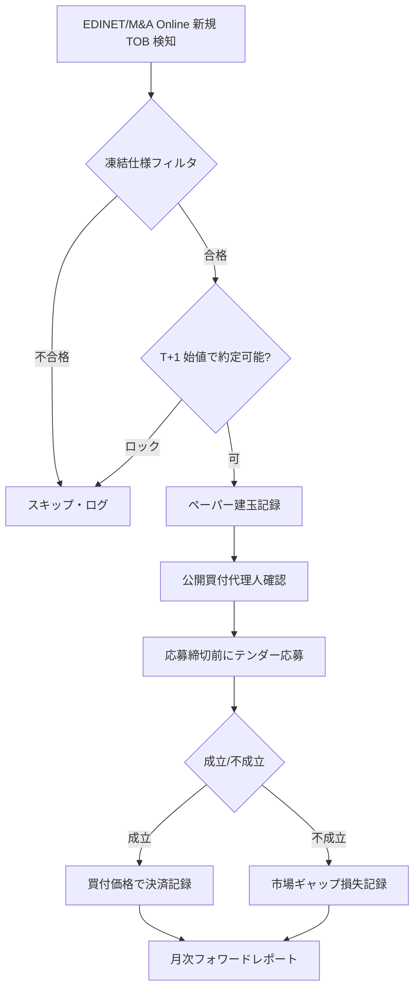

# 47 — C1 前向き運用設計 + オルタナティブデータパイプライン

**作成日**: 2026-06-28  
**前提**: `docs/09`（C1 診断・正式 DSR 裁定）, `docs/24`（データカタログ）, `HANDOFF.md`

---

## 0. エグゼクティブ・サマリー

| 領域 | 状態 | 次のアクション |
|---|---|---|
| **C1 TOB リスクアーブ** | バックテスト裁定済み（K=12・含みある PASS） | **凍結仕様で前向きペーパー運用** |
| **C2 アクティビスト** | ブロード母集団はエッジ無し・②複数参入のみ芽 | フォワードで N 積み増し |
| **TDnet 適時開示** | **本ドキュメントでパイプライン実装** | 毎営業日 `update_tdnet.py` |
| **ToSTNeT 超大口** | 実装済み（`jpx_tostnet.py`） | 2週間以内に `update_tostnet.py` |
| **アナリストコンセンサス** | 未着手 | 商用 or 手動（優先度中） |
| **決算カレンダー履歴** | 未着手 | fins/DiscDate 復元で代替可 |

---

## 1. C1 前向き運用設計（Phase 2 小サイズスリーブ）

### 1.1 裁定の要約（再掲・一人歩き防止）

scope `tob_arb` の正式裁定（`examples/judge_c1_tob_arb.py`・docs/09 §6）:

| 指標 | 値 |
|---|---|
| 方式 | **Path B**（イベントリターン直接 DSR。汎用エンジンはテンダー決済を表現できず棄却） |
| 最良セル（現行レジーム） | `2020-2026 / 競合除外 / spread>=3%` → DSR **0.94** |
| 現行レジーム PASS セル | `2020-2026 / 競合含む / spread>=3%` → DSR **0.98** |
| PBO(CSCV) | **0.51–0.54**（グリッド選択は過学習寄り） |
| 容量 p25 @10%参加率 | **¥224–286万**（小資本ニッチ） |
| 約定不能率 | **22%**（T+1 ストップ高ロック＝スキップ） |
| 按分リスク | **無視可能**（成立の4%のみ・平均影響 −0.17%） |
| 未検証 | **テンダー執行可能性**（代理人口座・応募期限・small-cap 偏重） |

**結論**: 約定可能・テンダー決済すれば正の risk-adjusted リターン。ただし PBO 高・レジーム依存・
小資本限定。**単一セル数値をそのまま実運用前提にしない**。

### 1.2 凍結仕様（2026-06 確定・再裁定まで変更禁止）

PBO 多重性を増やさないため、**1 仕様に固定**する:

```yaml
scope: tob_arb_forward          # 新規 scope（バックテスト K=12 とは別）
strategy_id: tob_arb(excl,spread>=3%)
subperiod: "2020-2026"           # 現行レジームのみ（フォワード対象）
competing: false                 # 競合案件除外（ソレキア型）
spread_min: 0.03                 # 当初価格/T+1始値 - 1 >= 3%
entry: T+1 始値                  # ストップ高ロックはスキップ（約定不能）
exit_success: 最終買付価格でテンダー
exit_fail: 不成立公表日+5営業日の市場価格
weighting: 同時進行案件へ等加重・0件日は現金
capital_per_deal: min(¥500,000, capacity_p25)  # 保守的上限
max_concurrent: 5                # 同時保有上限（キャッシュドラッグ管理）
```

**採用理由**:
- `競合除外` … 敗者 buyer 価格リークを排除（docs/09 §2.3）
- `spread>=3%` … 高スプレッド帯の不成立セレクションを回避（診断で単調増加を確認）
- `2020-2026` … フォワードは現行レジームのみを対象（過去の 2016-19 は参考に留める）

監視スクリプト: `examples/c1_forward_monitor.py`

### 1.3 日次〜案件単位の運用フロー



**データソース（優先順）**:
1. `data/edinet/tob_deals.parquet` … 当初価格（PIT 安全）
2. `data/manual/maonline/parsed/tob_detail.csv` … イベント表スパイン
3. `data/jquants/daily/` … T+1 始値・値幅制限

**夜間ジョブへの追加（将来）**:
- `examples/edinet_update.py` で TOB 新規を検知
- `examples/c1_forward_monitor.py` で適合案件をレポート
- Phase 2 manifest とは**別スリーブ**（旗艦 value↔PEAD+TSMOM と独立）

### 1.4 ペーパートレード必須チェックリスト

テンダー執行可能性はバックテストで閉じない（docs/09 §6.4 (ii)）。**最初の 3 案件で実務確認**:

| # | 確認項目 | 記録先 |
|---|---|---|
| 1 | 公開買付代理人はどの証券会社か（マイナー証券の可能性） | `data/phase2/c1_tender_log.csv` |
| 2 | 口座開設〜応募締切までに間に合うか | 同上 |
| 3 | 応募〜決済の実際のリードタイム | 同上 |
| 4 | 按分が発生したか（EDINET 270 と突合） | 同上 |
| 5 | 実現スプレッド vs モデルスプレッドの差 | 同上 |

**キルスイッチ**（いずれかで停止）:
- 連続 2 件の不成立（発表前水準への急落）
- フォワード 6 ヶ月で realized Sharpe < 0
- テンダー応募不能が 2 件連続

### 1.5 ポートフォリオへの組み込み

| 項目 | 方針 |
|---|---|
| 旗艦との関係 | **独立スリーブ**（相関低・イベント駆動） |
| 資本配分 | 総資産の **5–10%** 上限（小資本ニッチのため） |
| 同時保有 | 最大 5 案件・案件あたり ¥50万上限 |
| 再裁定 | K を払う（`tob_arb` K=12 に加算）。仕様変更は事前登録必須 |

---

## 2. オルタナティブデータパイプライン

### 2.1 TDnet 適時開示（**実装済み**）

| 項目 | 内容 |
|---|---|
| モジュール | `invest_system/data/sources/tdnet.py` |
| ランナー | `examples/update_tdnet.py` |
| 保存先 | `data/tdnet/{YYYYMMDD}.parquet` |
| 取得 URL | `https://www.release.tdnet.info/inbs/I_list_{page}_{date}.html` |
| 制約 | 公開閲覧 **約1ヶ月のみ**＝バックフィル不可・前向き蓄積 |
| 正準列 | `disclosure_date/time, code, company_name, title, pdf_url, xbrl_url, exchange, doc_id, event_tags` |

**イベントタグ（表題キーワード分類）**:

| タグ | 用途 | 解禁される分析 |
|---|---|---|
| `buyback_announce` | C3: 自社株買い発表 | 発表日ベースの還元イベント（§6.17 とは別仮説） |
| `buyback_result` | ToSTNeT-3 結果 | 買い戻し執行の追跡 |
| `tob_related` | C1 補助 | EDINET 提出前の早期シグナル |
| `guidance_revision` | PEAD 補助 | サプライズのタイミング精度向上 |
| `large_holder` | C2 補助 | 大量保有の適時開示（EDINET より早い場合あり） |

**運用（GitHub Actions 統合済み・2026-06-28）**:
`strategy-factory-ops/.github/workflows/phase2.yml` が毎晩 21:30 JST に
`update_tdnet.py --days 5` を実行（`continue-on-error`・`sf/data` キャッシュに蓄積）。
ローカル PC の定期実行は不要。手動デバッグ時のみ:

```powershell
$env:PYTHONUTF8="1"; .\.venv\Scripts\python.exe examples\update_tdnet.py --days 5
```

**C3 事前登録ドラフト**（データが 12 ヶ月溜まってから裁定）:
- scope: `tdnet_buyback_announce`
- 仮説: 取得枠**発表日**ベースなら、四半期 ΔTrShFY（§6.17 の死因）とは別信号
- エントリー: 発表日 T+1 始値
- prior: **中立以下**（PBR 改革後は即時織り込み→フェードのリスク）

### 2.2 JPX ToSTNeT 超大口（**実装済み**）

| 項目 | 内容 |
|---|---|
| モジュール | `invest_system/data/sources/jpx_tostnet.py` |
| ランナー | `examples/update_tostnet.py` |
| 保存先 | `data/jpx_tostnet/{YYYYMMDD}.parquet` |
| 制約 | 公開 **約2週間のみ**＝**2週間以内ごと**に実行必須 |
| 将来 | J-Quants Pro `/prices/tostnet_super_large_lot` へ移行（同一9列） |

**研究仮説（データ蓄積後）**:
- 機関の大型フロー → 翌日以降のドリフト/リバーサル
- セクター別フロー異常 → 旗艦の暴落ディフェンス補助
- 自己株買い ToSTNeT-3 と TDnet `buyback_result` の突合

詳細: `tostnet_monitoring_plan.md`

### 2.3 EDINET 日次ミラー（**実装済み**）

| 項目 | 内容 |
|---|---|
| モジュール | `invest_system/data/sources/edinet.py` |
| ランナー | `examples/edinet_update.py` |
| 用途 | C1 TOB・C2 大量保有・財務三表 |

C1/C2 の一次ソース。TDnet は**補助**（より早いが網羅性は低い）。

### 2.4 未実装パイプライン（優先度順）

#### P4: 決算発表カレンダー（優先度: 中）

| 項目 | 内容 |
|---|---|
| 課題 | J-Quants `/equities/earnings-calendar` は**前向きスナップショットのみ**（履歴なし） |
| 代替 | `fins_summary` の `DiscDate` から過去の発表日を復元（既存） |
| 外部候補 | 株探・会社四季報 API、ブルームバーグ（有料） |
| 解禁分析 | 決算 run-up、PEAD タイミング最適化 |

#### P5: アナリストコンセンサス（優先度: 中）

| 項目 | 内容 |
|---|---|
| 課題 | `fins_summary` の `FEPS` は**会社予想のみ**（市場コンセンサスではない） |
| 外部候補 | Refinitiv I/B/E/S、FactSet、日本経済新聞データバンク |
| 解禁分析 | 高精度 SUE、予想サプライズの精度向上 |

#### P6: ニュース・センチメント NLP（優先度: 低）

| 項目 | 内容 |
|---|---|
| 既存結果 | 開示テキスト NLP は **FAIL**（DSR 0.36–0.44） |
| 条件 | TDnet 表題 + 要約の軽量分類なら再挑戦の余地（全文 TF-IDF より） |

#### P7: サプライチェーン・求人・衛星（優先度: 低〜長期）

日本小型株向け商用データは限定的。個人運用ではコスト対効果が低い。

### 2.5 パイプライン統合アーキテクチャ

```
L0 Raw（前向き蓄積・gitignore）
├── jquants/*          … 市場・財務（日次差分・実装済み）
├── edinet/*           … 法定開示（日次差分・実装済み）
├── tdnet/*            … 適時開示一覧（日次・本ドキュメントで追加）
├── jpx_tostnet/*      … 超大口約定（日次・実装済み）
└── [将来] consensus/  … アナリスト予想

L1 イベント索引（派生）
├── edinet/tob_deals.parquet
├── edinet/large_holdings*.parquet
└── tdnet/events_{tag}.parquet  … タグ別抽出（将来）

L2 戦略スリーブ
├── 旗艦: value↔PEAD + TSMOM（Phase 2 稼働中）
├── C1: tob_arb_forward（本ドキュメント・凍結仕様）
├── C2: c2_escalation_multi（preregistered・フォワード待ち）
└── C3: tdnet_buyback_announce（データ待ち・12ヶ月後）
```

---

## 3. 実装チェックリスト

- [x] C1 凍結仕様の文書化（§1.2）
- [x] `examples/c1_forward_monitor.py`（凍結仕様スクリーニング）
- [x] `invest_system/data/sources/tdnet.py`（パーサ＋蓄積）
- [x] `examples/update_tdnet.py`（日次ランナー）
- [x] `tests/test_tdnet.py`（オフライン検証）
- [ ] `data/phase2/c1_tender_log.csv` テンプレート（初回ペーパー時に作成）
- [x] 夜間ジョブ（strategy-factory-ops）へ `update_tdnet.py` 追加（phase2.yml）
- [ ] TDnet 12 ヶ月蓄積後 → C3 事前登録・裁定

---

## 4. 参照

- C1 裁定: `docs/09` §5–6, `examples/judge_c1_tob_arb.py`
- C2 エスカレーション: `docs/12`, `HANDOFF.md`
- データカタログ: `docs/24` §3.11（TDnet）
- ToSTNeT: `tostnet_monitoring_plan.md`